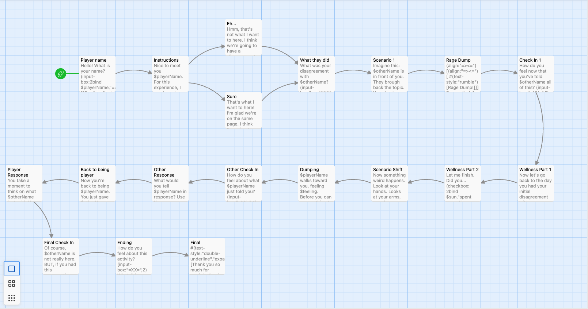

# First prototype for capstone
Summary: A text-based interaction modeling the Slice RA Conflict Training at NYUAD. It was creating using Twine.

# Background

For this first prototype, I wanted to explore the ways people could interact with computers to learn techniques for conflict resolution. I read some of the handouts of the MIT OpenCourse <a href="https://ocw.mit.edu/courses/15-667-negotiation-and-conflict-management-spring-2001/pages/lecture-notes/">Negotiation and Conflict Management</a> alongside the book The Big Book of Conflict Resolution Games by Mary Scanell. Both readings reaffirmed the importance of games as a learning mechanism for conflict resolution strategies since they are low risk and they generate the conditions that usually lead to conflict (competition, lose-win situations, etc). 

The readings stated how one of the key skills that people should learn in order to engage in conflict successfully is fascilitation. Being able to fascilitate a conversation between seemly oppposing sides. I thus thought of creating a low stake interation that involved the user fascilitating dialogue between themselves and the person they are engagin in conflict with. 

However, I wanted to first test out if a one user-computer could be an effective method of teaching. So, I decided to use the text-based interactive narrative creation tool Twine, to create a scenario exercise fascilitating the user's reframing of their perseption of the person they are having a conflict with. 

The interaction depicted in Prototype 1 is based on the SLICE RA Conflict Training and on the Wellness Checklists from <a href="https://teambuilding.com/">teambuilding.com</a>

# Creating Prototyping

## Outline

I created a simple map of the interactive story, taking into consideration the inputs from the user. I marked the variables that needed saving in green. The bigger inputs were marked in blue and not all of them where actually saved. 

This is the original outline that was take as a model for the prototype in Twine. 

## Making a Hypertext Experience

The prototype was created in Twine. A digital tool that allows people to create hypertext stories that can be exported as HTML files. It is based on basic HTML, CSS and Javascript. Twine also has tools for creating and storing variable and debugging.

This is how the final version of prototype 1 looks like in the Twine interface:

The prototype has not yet been tested but it will be in the following week. 

The experience itself can be accessed <a href=""> here. </a>
